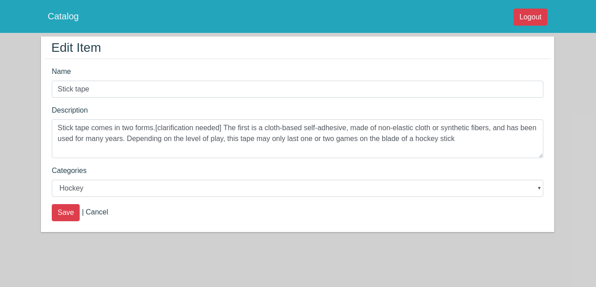

# Catalog

This application implement a basic catolog web application using the flask framework with oauth authentication.

# Requirements

In this repo there is a requirements.txt file listing all the library used.
To install all them type **pip install -r requirements.txt**.

# Installing the Vagrant VM for run the catalog project.

### Git

If you don't already have Git installed, [download Git from git-scm.com.](http://git-scm.com/downloads) Install the version for your operating system.

You will need Git to install the configuration for the VM.

### VirtualBox

VirtualBox is the software that actually runs the VM. [You can download it from virtualbox.org, here.](https://www.virtualbox.org/wiki/Downloads)  Install the *platform package* for your operating system.  You do not need the extension pack or the SDK. You do not need to launch VirtualBox after installing it.

### Vagrant

Vagrant is the software that configures the VM and lets you share files between your host computer and the VM's filesystem.  [You can download it from vagrantup.com.](https://www.vagrantup.com/downloads) Install the version for your operating system.

## Fetch the Source Code and VM Configuration

From the terminal, run:

    git clone https://github.com/ericmbf/fullstack-nanodegree-vm.git

This will give you a directory named **catalog** inside vagrant folder.

## Run the virtual machine!

Using the terminal, go to vagrant directory and type **vagrant up** to build the vagrant VM.

## Running the Catalog App

After build process from vagrant, type **vagrant ssh** to enter to VM. After using tha application maybe you want to go out from VM. Using **vagrant halt** fot it.

Now you can go to python file typing **cd /vagrant/catalog**. You can see the **insertCategories.py** file. Execute this script to create the database with some categories and items, typing **python insertCategories.py**. After this, you can start the web flask application type **python application.py**.

## API

JSON

Examples:

http://localhost:/catalog/Categories.json

Returns all categories.

```
{
  "Categories": [
    {
      "id": 1, 
      "name": "Hockey"
    }, 
    {
      "id": 2, 
      "name": "Soccer"
    }, 
    {
      "id": 3, 
      "name": "Basketball"
    }, 
    {
      "id": 4, 
      "name": "Baseball"
    }, 
    {
      "id": 5, 
      "name": "Frisbee"
    }, 
    {
      "id": 6, 
      "name": "Snowboarding"
    }, 
    {
      "id": 7, 
      "name": "Rock Climbing"
    }, 
    {
      "id": 8, 
      "name": "Foosball"
    }, 
    {
      "id": 9, 
      "name": "Skating"
    }
  ]
}
```
http://localhost:/catalog/<string:category_name>/<string:item_name>.json

Returns the details of a given <item_name> from <category_name>

```
{
  "cat_id": 1,
  "description": "Long description",
  "id": 1,
  "name": "Stick"
}
```

http://localhost:/catalog/<string:category_name>/Items.json

Returns the all items from <category_name>

```
{
  "Items": [
    {
      "cat_id": 1, 
      "description": "Long description", 
      "id": 1, 
      "title": "Stick"
    }, 
    {
      "cat_id": 1, 
      "description": "Long description", 
      "id": 2, 
      "title": "Stick tape"
    }
  ]
}
```

http://localhost:8000/catalog.json

Returns all Categories and Items from the database
```
[
  {
    "id": 1,
    "items": [
      {
        "cat_id": 1,
        "description": "Long description",
        "id": 1,
        "name": "Stick"
      },
      {
        "cat_id": 1,
        "description": "",
        "id": 4,
        "name": "Shinguards"
      }
    ],
    "name": "Soccer"
  },
  {
    "id": 4,
    "items": [],
    "name": "Frisbee"
  },
  {
    "id": 5,
    "items": [
      {
        "cat_id": 5,
        "description": "",
        "id": 2,
        "name": "Goggles"
      },
      {
        "cat_id": 5,
        "description": "",
        "id": 3,
        "name": "Snowboard"
      }
    ],
    "name": "Snowboarding"
  }
]
```

# Examples

- Login Page


- Latest Items


- Item Description


- Edit Page


- Delete Page


You can acess the web page in your browser visiting the **http://localhost:8000** URL.
You should be able to view, add, edit, and delete items from catalog.